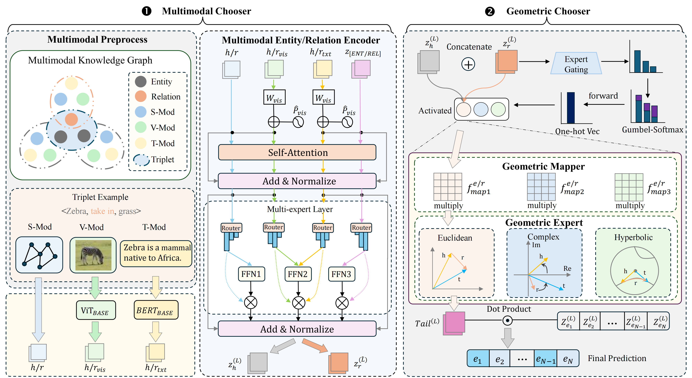

<h1 align="center">
  ChoicE
</h1>
<h4 align="center">Make Your Choice for Multimodal Knowledge Graph Completion</h4>

<h2 align="center">
  Overview of ChoicE
  
</h2>

This paper has been submitted to the Knowledge-based Systems.

### Dependencies

- python            3.7
- torch             1.21.1
- numpy             1.21.5
- scikit-learn      1.0.2
- scipy             1.7.3


### Dataset:

- We use WN18RR++, FB15K237, VTKG-C and VTKG-I dataset for knowledge graph completion. 
- You should first download the preprocessed data from https://drive.google.com/file/d/1u4QthmEboMzRarF_HLYfLDOLcOZeH8Gp/view?usp=drive_link and put them in the `./data` directory.

### Results:
The results are:

|  Dataset   |   MRR  |   H@1  |   H@3  |  H@10  |
| :--------: | :---:  |  :---: |  :---: |  :---: |
|  WN18RR++  | 0.5856 | 0.5316 | 0.6053 | 0.7014 |
| WikiPeople | 0.451 | 0.374 | 0.492 | 0.588 |
|  FB-AUTO   | 0.880 | 0.862 | 0.890 | 0.911 |

## How to Run
```
python main-JF17K.py                 ## JF17K dataset
python main-WikiPeople.py            ## WikiPeople dataset
python main-FB-AUTO.py               ## FB-AUTO dataset
```
